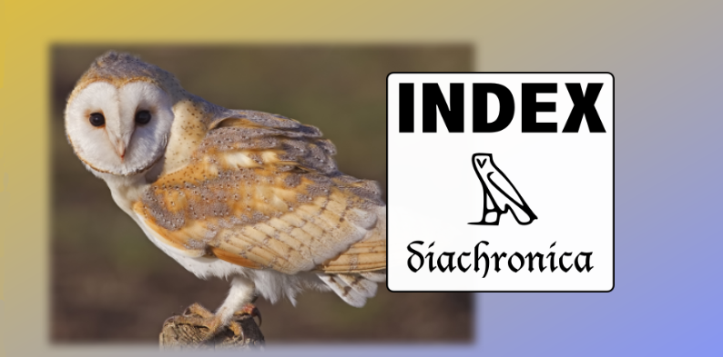
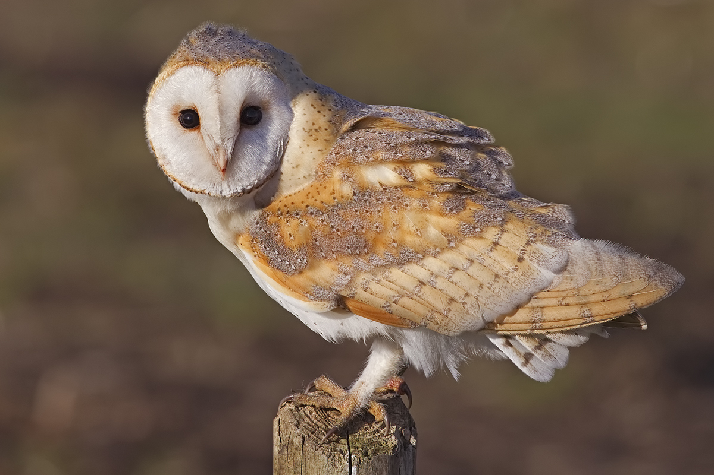

# Index Diachronica Database Project


*The Index Diachronica as a database*


## What is it?

The Index Diachronica Database Project aims to convert the Index Diachronica, a collection of historical sound changes, into a text-based
database and mantain and solidify the dataset.

The Index Diachronica is a giant catalog of [sound changes](https://en.wikipedia.org/wiki/Sound_change). It has sections on many languages and language families, as well as a fairly well-structured presentation of historical sound changes in those languages.
It is hosted here: [Index](https://chridd.nfshost.com/diachronica/) 

@amundo and @man-in-space had the idea to convert this document into a database of json files, because then the rules are data, and we can do all kinds of neat things with them. 

However there has been no activity on the project since 8 years. So I sneakily decided to fork the project and actually do it for real.

## Roadmap
- July: release v0.1.0 
- till September: decide on format 
- after that: start checking the rules, fix broken stuff and search new sound changes
 
## Notes
- sound changes and references will be converted into a standard format
- The Index Diachronica (usually) includes references. This means that the 
database could be checkable by experts in various fields.
- There are phonological inventories mixed into the soundchanges. Inventories are awesome, but they are a separate project. It would make sense to have a separate project, (perhaps we could call it the _Index Phonologica_!) to handle that. ()

## The format
the following briefly outlines the format of the natural  classes ID uses. For the reasoning please refer to [rants/features.md]
**all the classes will remain close to the source but transcribed into [+bla -blub]. The list of available natural classes will be extended to also cover all IPA groupings.**
```
Q => [+uvular ] and not [+consonantal +velar +back]
L = [+liquid] and not [+consonantal +approximant] Liquid
```
**All compound classes SHOULD be valid, but that won't be enforced through some feature geometry**
```
valid = [+vowel +front]
invalid = [+plosive +front]
```
### all classes
```
consonant
vowel
front
back
fricative
approximant
palatovelar
velar
liquid
nasal
sonorant
labial *
bilabial *
uvular
click
plosive
retroflex
voice
syllable
semivowel
continuant
affricate
laryngeal

* in the original ID P = Labial/Bilabial. Therefore all instances of P are [+labial,bilabial].
```

### Show me your bibliography ...

The bibliography will use [Hayagriva](https://github.com/typst/hayagriva) once I converted all the sources to this format.

Example:

```toml
[[cs]]
fr = "Proto-Malayo-Polynesian"
to = "Proto-North Sarawak"
or = "Whimemsz"
os = " from Blust, Robert (2002), “Kiput Historical Phonology”. Oceanic Linguistics 41(2):384 – 438; and Blust, Robert (2007), “Òma Lóngh Historical Phonology”. Oceanic Linguistics 46(1):1 – 53"
so = [
    "s10_9",
    "s10_10",
]
no = []
...
```

refers to

```yaml
s10_9:
  author: Blust, Robert
  date: 2002 
  title: "Kiput Historical Phonology"
  parent: 
    title: Oceanic Linguistics
    issue: 41
    volume: 2
    page-range: 384 – 438
  
s10_10:
  author: Blust, Robert
  date: 2007 
  title: "Òma Lóngh Historical Phonology"
  parent: 
    title: Oceanic Linguistics
    issue: 46
    volume: 1
    page-range: 1 – 53 
```

## Contributing 

Get involved! We're just getting started. 

Say hello: https://github.com/quilde/indexdiachronica/discussions/22

discuss the latest release: https://github.com/quilde/indexdiachronica/discussions/23

<!--submit sound changes:

help coding:

discuss philosophical stuff regarding the index: 
-->

## Logo and Mascot



I like the logo, however it maybe isn't fully representative of the project (one could think it's only about egyptian stuff), so we might change it. I want to keep the owl though, so I decided to make it the mascot.